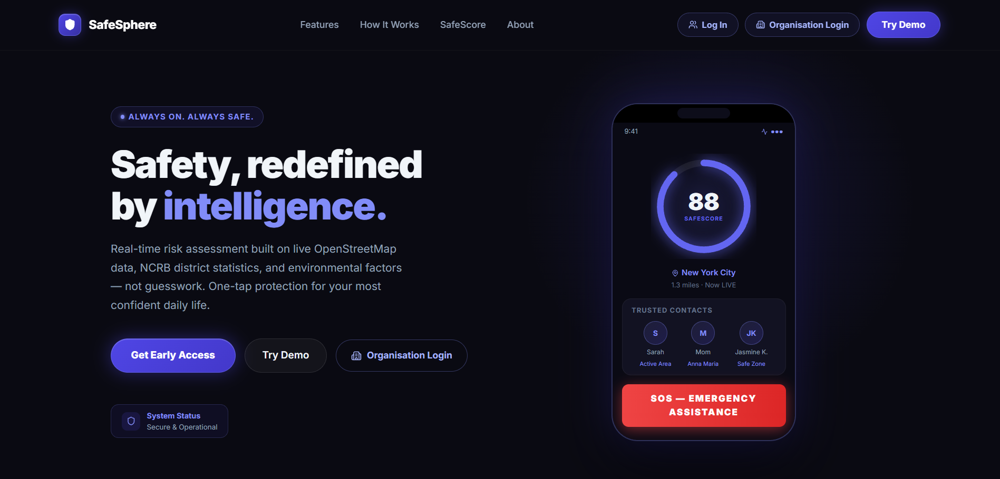
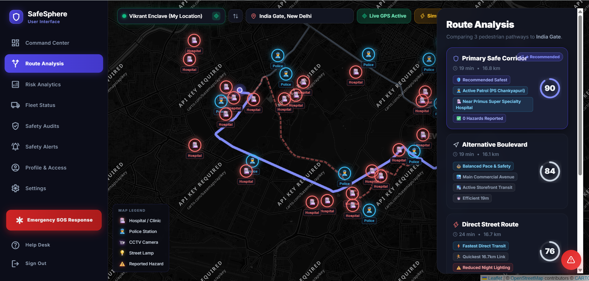
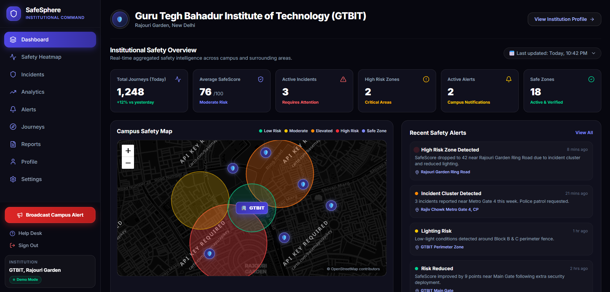

# 🛡️ SafeSphere

### Safety-First Navigation & Journey Intelligence Platform

> **Navigate with intelligence, not anxiety.**

SafeSphere is a **safety-aware navigation and journey intelligence platform** designed to help people make safer travel decisions by considering factors that conventional navigation systems often overlook.

Instead of asking only:

> **“What is the fastest route?”**

SafeSphere asks:

> **“What is the safest practical route — and why?”**

It combines **route geometry, environmental safety signals, incident data, proximity to emergency infrastructure, and district-level safety information** to generate an explainable **SafeScore™** for candidate routes.

The platform also includes **Journey Guardian, Emergency SOS, trusted contacts, hazard reporting, and an Institutional Command Center** for campuses and organizations.

---

## 🚀 Why SafeSphere?

Traditional navigation is primarily optimized around **distance, travel time, and traffic**.

But for a person walking alone at night, the fastest route may not necessarily be the route they feel safest taking.

A route can be:

* Short but poorly lit
* Fast but isolated
* Convenient but far from emergency infrastructure
* Popular during the day but significantly less suitable at night

SafeSphere introduces a **safety layer on top of navigation**.

### The core idea

```text
             TRADITIONAL NAVIGATION
                     │
          ┌──────────┴──────────┐
          │                     │
       Distance               Time
          │                     │
          └──────────┬──────────┘
                     ▼
                FASTEST ROUTE


                  SAFESPHERE
                     │
      ┌──────────────┼──────────────┐
      ▼              ▼              ▼
   Lighting      Incidents       Emergency
      │              │           Infrastructure
      └──────────────┼──────────────┘
                     ▼
                SafeScore™
                     │
                     ▼
        SAFEST PRACTICAL ROUTE
```

---

# ✨ What Makes SafeSphere Different?

SafeSphere is not simply a map with an SOS button.

It is built around four principles:

### 1. 🧭 Proactive Safety

Safety is considered **before** a journey begins rather than only after something goes wrong.

### 2. 🔍 Explainable Decisions

The SafeScore is designed to show *why* a route receives its score instead of presenting an unexplained number.

### 3. 🛡️ Journey-Level Protection

Once a journey starts, SafeSphere can continue monitoring the journey instead of stopping at route selection.

### 4. 🏢 Institutional Intelligence

Organizations can view aggregated safety patterns around their campuses and operational areas without exposing individual user journeys.

---

# 🎯 Core Features

## 🗺️ 1. Explainable Safety-Aware Routing

Users can compare multiple pedestrian routes based on different priorities.

### Route modes

* **Safest** — prioritizes safety-related factors
* **Fastest** — prioritizes travel time/distance
* **Balanced** — attempts to balance safety and convenience

Every candidate route receives a **SafeScore from 0–100**.

Instead of simply saying:

> Route A is better.

SafeSphere can explain the factors contributing to that recommendation, such as:

* Lighting availability
* Nearby police infrastructure
* Nearby hospitals/clinics
* Reported hazards/incidents
* Pedestrian infrastructure
* Isolation/density indicators
* District-level safety baseline

---

## 🧮 2. SafeScore™

The SafeScore is the core intelligence layer of SafeSphere.

A route score is calculated using multiple safety signals:

```text
                    Candidate Route
                          │
          ┌───────────────┼────────────────┐
          ▼               ▼                ▼
      Lighting        Incidents        Police / Zones
          │               │                │
          └───────────────┼────────────────┘
                          │
                          ▼
                  Density / Isolation
                          │
                          ▼
                District Risk Baseline
                          │
                          ▼
                     SafeScore™
                     0 ───── 100
```

### Mathematical model

For each candidate route segment:

$$
S =
\text{clamp}
\left(
0,100,
\left(
w_LS_{\text{lighting}}
+
w_IS_{\text{incidents}}
+
w_PS_{\text{police}}
+
w_DS_{\text{density}}
\right)
+
\Delta_{\text{district}}
\right)
$$

The system uses different weighting between daytime and nighttime conditions.

| Safety Factor          |  Day |    Night | Signal                                  |
| ---------------------- | ---: | -------: | --------------------------------------- |
| 💡 Lighting            | 0.25 | **0.45** | OSM lighting information                |
| ⚠️ Incident Risk       | 0.35 |     0.35 | Recent reported incidents               |
| 👮 Police / Safe Zones | 0.20 |     0.20 | Distance to safety infrastructure       |
| 🚶 Density / Isolation | 0.20 | **0.40** | Pedestrian & surrounding POI indicators |
| 🏙️ District Baseline  |  ±10 |      ±10 | NCRB-based regional modifier            |

### Why nighttime weighting matters

A poorly lit or isolated segment can represent a very different safety consideration at **11 PM** than at **2 PM**.

SafeSphere therefore increases the importance of lighting and isolation-related signals during nighttime hours.

---

# 🌐 3. Live Geospatial Intelligence

SafeSphere doesn't rely solely on static route data.

The platform queries geospatial infrastructure around candidate routes using **OpenStreetMap data through the Overpass API**.

The system can extract information such as:

* `lit=yes/no` roadway information
* Police stations and patrol posts
* Hospitals and clinics
* Pedestrian infrastructure
* Footways
* Buildings and surrounding urban density

The architecture document specifies route-area queries in approximately the **300–500 m spatial range**, while individual safety measurements can use smaller local buffers.

---

# 🛡️ 4. Journey Guardian

Choosing a route is only the beginning.

**Journey Guardian** is designed to continue protecting the traveler while the journey is active.

During an active journey, SafeSphere can monitor journey state and respond to anomalies such as:

* Route deviation
* Unexpected journey conditions
* Loss of connectivity
* Increased risk ahead
* Potential need for a safer alternative

The goal is to shift safety from:

```text
Search → Select Route → Done
```

to:

```text
Search
  ↓
Analyze
  ↓
Choose
  ↓
Start Journey
  ↓
Monitor
  ↓
Detect Risk
  ↓
Warn / Redirect / Escalate
```

---

# 🚨 5. Emergency SOS

SafeSphere includes a dedicated emergency response layer.

The SOS flow is designed around a **confirmation-gated emergency trigger**, helping reduce accidental activation while still keeping emergency assistance easily accessible.

The system can connect the emergency event to:

* Trusted contacts
* Current journey information
* User location
* Emergency notification workflows

### Example journey

```text
Potential Emergency
       ↓
    SOS Trigger
       ↓
Confirmation Gate
       ↓
Emergency Event
       ↓
Location + Journey Context
       ↓
Trusted Contact Notification
```

---

# 👥 6. Trusted Contact Network

Users can maintain a network of trusted contacts such as:

* Family
* Friends
* Guardians

These contacts form the personal safety network that can be involved during an emergency or journey-monitoring workflow.

---

# ⚠️ 7. Crowdsourced Hazard Reporting

Safety information should not only come from external datasets.

SafeSphere also supports user-generated safety signals through hazard/incident reporting.

This allows the system to incorporate localized information that may not immediately exist in structured geographic datasets.

---

# 🏢 8. Institutional Command Center

SafeSphere isn't limited to individual travelers.

It also includes a dedicated **Organisation / Institutional Command Center** for organizations such as:

* Universities
* Colleges
* Corporate campuses
* Large workplaces
* Security teams

The institutional interface aggregates safety intelligence around an organization's operational area.

### Institutional capabilities

* 🗺️ Safety heatmaps
* 🚨 Incident registry
* 📊 Safety analytics
* 🔔 Campus-wide alerts
* 🧭 Journey intelligence
* 📈 Longitudinal safety trends
* 🛡️ Safety zones
* 📋 Safety reports and audit workflows

The architecture defines the consumer and organization experiences as two separate portals within the same SafeSphere ecosystem.

---

# 📸 Product Screenshots

## Landing Page

The landing experience communicates the core proposition while showcasing the SafeScore and emergency layer.



---

## Safety-Aware Route Analysis

Users can compare routes and understand the safety reasoning behind each recommendation.



---

## Institutional Command Center

Organizations receive an aggregated view of safety conditions around their campus or operational area.




---

# 🧠 System Architecture

SafeSphere follows a layered architecture separating the presentation layer, application logic, geospatial intelligence, and persistent data.

```text
                         ┌─────────────────────┐
                         │      SAFESPHERE      │
                         └──────────┬──────────┘
                                    │
                    ┌───────────────┴───────────────┐
                    │                               │
                    ▼                               ▼
          ┌──────────────────┐           ┌──────────────────────┐
          │  CONSUMER PORTAL │           │ ORGANISATION PORTAL  │
          └────────┬─────────┘           └──────────┬───────────┘
                   │                                │
                   └───────────────┬────────────────┘
                                   ▼
                       ┌────────────────────────┐
                       │    React / Vite App    │
                       │ TypeScript + Tailwind  │
                       └────────────┬───────────┘
                                    │
                                    ▼
                       ┌────────────────────────┐
                       │   Application / API    │
                       │    Node.js / Express   │
                       └────────────┬───────────┘
                                    │
             ┌──────────────────────┼──────────────────────┐
             ▼                      ▼                      ▼
      ┌─────────────┐       ┌──────────────┐       ┌──────────────┐
      │  Supabase   │       │   Overpass   │       │    OSRM      │
      │ PostgreSQL  │       │     API      │       │   Routing    │
      │ Auth/RLS    │       │ OSM Data     │       │              │
      └─────────────┘       └──────────────┘       └──────────────┘
             │
             ▼
      ┌─────────────┐
      │ SafeScore   │
      │   Engine    │
      └──────┬──────┘
             │
             ▼
      ┌────────────────┐
      │ Route / Risk   │
      │ Intelligence  │
      └────────────────┘
```

---

# 🔄 End-to-End Data Flow

A typical route-analysis request follows this pipeline:

```text
1. User enters destination
              ↓
2. Geocoding resolves location
              ↓
3. Routing engine generates
   candidate pedestrian routes
              ↓
4. SafeSphere identifies route
   segments / safety corridor
              ↓
5. Overpass queries nearby
   OSM infrastructure
              ↓
6. Historical district data
   is applied
              ↓
7. SafeScore engine evaluates
   each route
              ↓
8. Routes are ranked
   by user preference
              ↓
9. Explainable route comparison
   is shown to the user
              ↓
10. User starts Journey Guardian
```

---

# 🌍 Geospatial Technology

SafeSphere uses an open geospatial stack rather than depending entirely on proprietary mapping infrastructure.

| Component               | Technology                          | Purpose                                         |
| ----------------------- | ----------------------------------- | ----------------------------------------------- |
| Map rendering           | Leaflet + React-Leaflet             | Interactive map interface                       |
| Map tiles               | CartoDB Dark Matter + OpenStreetMap | Dark, high-contrast visualization               |
| Geospatial calculations | Turf.js                             | Buffering, containment and spatial calculations |
| Map data                | OpenStreetMap                       | Infrastructure and geographic features          |
| Spatial queries         | Overpass API                        | Nearby safety infrastructure                    |
| Geocoding               | Photon                              | Search and reverse geocoding                    |
| Routing                 | OSRM                                | Pedestrian route generation                     |

The technical architecture specifically uses Turf.js for corridor buffering, point-in-polygon checks, and distance-related calculations.

---

# 🔌 External Data Sources & APIs

| Source                             | Role                                                                                       |
| ---------------------------------- | ------------------------------------------------------------------------------------------ |
| **OpenStreetMap / Overpass API**   | Lighting, police, hospitals, pedestrian infrastructure and surrounding geographic features |
| **Photon Geocoder**                | Location search, autocomplete and reverse geocoding                                        |
| **OSRM**                           | Pedestrian route geometry and candidate route generation                                   |
| **NCRB district-level statistics** | Historical regional safety baseline                                                        |
| **Supabase**                       | Application data, authentication and realtime functionality                                |

The architecture documentation identifies Overpass, Photon, OSRM, and the NCRB district layer as the primary external data sources used by SafeSphere.

---

# 🔐 Security & Privacy

Safety applications handle sensitive information, particularly location and journey data.

SafeSphere therefore separates user data and institutional intelligence at the database and authorization layers.

### Authentication

Authentication is handled through **Supabase Auth** using JWT-based authentication.

### Row-Level Security

PostgreSQL **Row-Level Security (RLS)** is used to enforce access boundaries.

The intended model is:

```text
Consumer Data
     │
     ├──► Consumer Access
     │
     └──X──► Institutional Admin

Institution A
     │
     └──► Institution A Data

Institution B
     │
     └──► Institution B Data
```

Institutional records are partitioned using `institution_id`, while consumer data is isolated from institutional administrative access.

### Server-Side Trust

Safety-critical scoring and emergency-related workflows are not intended to rely solely on client-side values.

This reduces the ability of a client to arbitrarily manipulate safety calculations or emergency events.

### Privacy by Design

Institutional analytics are designed around **aggregated safety intelligence** rather than exposing individual journeys unnecessarily.

---

# 🧩 Technology Stack

## Frontend

* React 19
* TypeScript
* Vite
* Tailwind CSS
* React Router
* Lucide React
* Recharts

## Backend

* Node.js
* Express
* TypeScript

## Database & Authentication

* Supabase
* PostgreSQL
* PostGIS
* Supabase Auth
* Supabase Realtime
* PostgreSQL Row-Level Security

## Maps & Geospatial

* Leaflet
* React-Leaflet
* OpenStreetMap
* CartoDB Dark Matter
* Turf.js

## APIs

* Overpass API
* Photon
* OSRM
* NCRB district-level safety dataset

## Deployment

* Vercel
* Supabase

The architecture documentation specifies the underlying stack as TypeScript, React 19, Vite 8, Tailwind CSS v4, Leaflet, Turf.js, Supabase/PostgreSQL/PostGIS, and Supabase Realtime.

---

# 📁 Repository Structure

```text
SafeSphere/
│
├── frontend/
│   ├── src/
│   │   │
│   │   ├── components/
│   │   │   ├── ConsumerNav.tsx
│   │   │   └── RouteAnalysisPanel.tsx
│   │   │
│   │   ├── context/
│   │   │   └── AuthContext.tsx
│   │   │
│   │   ├── pages/
│   │   │   ├── LandingPage.tsx
│   │   │   ├── LoginPage.tsx
│   │   │   ├── RegisterPage.tsx
│   │   │   ├── RoutesPage.tsx
│   │   │   ├── EmergencyPage.tsx
│   │   │   │
│   │   │   ├── organisation/
│   │   │   │   ├── OrganisationLoginPage.tsx
│   │   │   │   ├── OrganisationRegisterPage.tsx
│   │   │   │   └── OrganisationDashboardPage.tsx
│   │   │   │
│   │   │   └── institution/
│   │   │
│   │   ├── services/
│   │   │   ├── safeScoreService.ts
│   │   │   └── incidentService.ts
│   │   │
│   │   ├── App.tsx
│   │   └── main.tsx
│   │
│   ├── package.json
│   └── vite.config.ts
│
├── assets/
│   ├── landing-page.png
│   ├── route-analysis.png
│   └── institutional-dashboard.png
│
├── ARCHITECTURE.md
├── DOCUMENTATION.md
├── INSTALLATION.md
└── database-schema.sql
```

The documented repository structure separates UI components, authentication context, consumer/organization pages, and backend-facing services such as SafeScore and incident handling.

---

# 🏗️ Dual-Portal Product Architecture

SafeSphere essentially operates as two connected products.

## 👤 Consumer Experience

Designed around personal safety.

```text
Route Search
     ↓
Route Comparison
     ↓
SafeScore
     ↓
Journey Selection
     ↓
Journey Guardian
     ↓
Risk Detection
     ↓
SOS / Trusted Contacts
```

### Consumer capabilities

* Route search
* SafeScore
* Fastest / Safest / Balanced routing
* Route analysis
* Journey Guardian
* Trusted contacts
* Hazard reporting
* Emergency SOS
* Personal journey monitoring

---

## 🏢 Organisation Experience

Designed around institutional safety intelligence.

```text
Campus / Organisation
         ↓
Safety Data Aggregation
         ↓
Heatmap
         ↓
Incident Detection
         ↓
Risk Analysis
         ↓
Alerts
         ↓
Institutional Action
```

### Organisation capabilities

* Institutional dashboard
* Safety heatmaps
* High-risk zone identification
* Incident registry
* Safety alerts
* Journey analytics
* Safety-zone management
* Broadcast alerts
* Reports and audit workflows

---

# 📊 SafeScore: From Raw Data to Decision

One of the most important design decisions in SafeSphere is that the score should be **explainable**.

Instead of:

```text
Route A → 90
Route B → 84
Route C → 76
```

the system aims to provide context:

```text
Route A → 90

✓ Strong lighting coverage
✓ Police infrastructure nearby
✓ No recent reported hazards
✓ Better pedestrian infrastructure
✓ Lower isolation penalty
```

This makes the score useful as a **decision-support signal**, rather than just another arbitrary number.

---

# 🌙 Time-Aware Safety

Safety conditions are not static throughout the day.

SafeSphere therefore changes the relative importance of certain factors during nighttime.

### Example

```text
DAY

Distance       ██████████
Incidents      ██████████████
Lighting       █████████
Police         ███████
Density        ███████


NIGHT

Lighting       ██████████████████
Density        ████████████████
Incidents      ██████████████
Police         ███████
Distance       Less dominant
```

The architecture specifies nighttime weighting from approximately **9 PM–5 AM**, with lighting and density/isolation becoming significantly more influential.

---

# ⚡ Performance-Oriented Architecture

SafeSphere was designed as a modern web application with lightweight geospatial rendering and serverless-friendly infrastructure.

### Design goals

* Component-driven frontend
* Typed API/state models
* Lightweight map rendering
* Spatial querying
* Database-level authorization
* Realtime event capabilities
* Serverless deployment
* Separation of consumer and institutional access

---

# 🏆 Built in 24 Hours

SafeSphere was developed during a **24-hour hackathon** by a **2-person team**.

### My role

I served as the **technical lead and sole technical contributor**, responsible for the end-to-end technical implementation.

### Responsibilities

#### 🎨 Frontend

* Designed and implemented the React interface
* Built route analysis screens
* Built live map interactions
* Implemented consumer navigation flows
* Built emergency/SOS experience
* Developed institutional dashboard interfaces

#### ⚙️ Backend

* Built Node.js/Express API layer
* Implemented request handling and validation
* Integrated external data services
* Orchestrated geospatial data processing

#### 🧠 SafeScore Engine

* Designed route scoring logic
* Integrated environmental safety signals
* Implemented weighting and risk modifiers
* Added district-level baseline adjustments

#### 🗄️ Database

* Designed PostgreSQL/Supabase data structures
* Implemented authentication
* Configured Row-Level Security
* Integrated realtime capabilities

#### 🌍 API Integration

* OpenStreetMap / Overpass
* Photon
* OSRM
* Supabase

#### 🚀 Deployment

* Configured production deployment
* Deployed the working application
* Connected frontend, backend and database services

---

# 🧪 Demo

The deployed demo showcases:

1. Landing page
2. Consumer login
3. Route search
4. Route comparison
5. SafeScore analysis
6. Safety infrastructure visualization
7. Journey monitoring
8. Emergency SOS
9. Organisation login
10. Institutional dashboard
11. Safety heatmap
12. Incident and alert intelligence

---

# ⚠️ Important Data Considerations

SafeSphere is a **decision-support and safety-intelligence prototype**, not a guarantee of physical safety.

Its results depend on the quality, availability and freshness of the underlying data.

For example:

* OpenStreetMap coverage can vary by location.
* Lighting information depends on mapped infrastructure.
* District-level crime statistics cannot describe every individual street.
* Reported incidents may be incomplete.
* Geospatial services depend on network/API availability.
* A high SafeScore should never be interpreted as “this route is guaranteed safe.”

The purpose of SafeSphere is to provide **more safety context than conventional route optimization alone**, not to predict or guarantee whether an incident will occur.

---

# 🔮 Future Scope

SafeSphere's architecture can be extended significantly beyond the current prototype.

### 🤖 Machine Learning Risk Prediction

Train models on historical route, incident, temporal and environmental patterns to predict changing risk levels.

### 📡 Real-Time Crowd Signals

Integrate privacy-preserving aggregate mobility/crowd signals to improve the density and isolation model.

### 🛰️ Computer Vision

Use privacy-preserving computer vision to estimate environmental conditions such as:

* Lighting quality
* Crowd presence
* Road accessibility
* Infrastructure conditions

### 🚓 Emergency Service Integration

Connect with verified emergency-service infrastructure for faster escalation.

### 📱 Native Mobile Applications

Extend the web experience into Android/iOS applications for deeper background journey monitoring and device-level capabilities.

### 🏙️ Smart-City Integration

Provide APIs and dashboards for municipal safety teams and urban planners.

### 📈 Advanced Institutional Analytics

Introduce:

* Risk trend forecasting
* Shift-based security planning
* Incident clustering
* Patrol optimization
* Campus route recommendations
* Automated safety reports

---

# 🧭 Product Philosophy

SafeSphere is built around a simple idea:

> **Safety should be part of navigation, not an emergency feature added after navigation fails.**

The platform combines:

```text
Navigation
     +
Geospatial Intelligence
     +
Environmental Signals
     +
Historical Safety Data
     +
Journey Monitoring
     +
Emergency Response
     +
Institutional Intelligence
```

into a single safety-aware mobility ecosystem.

---

# 📌 Project Information

|                            |                                                |
| -------------------------- | ---------------------------------------------- |
| **Project**                | SafeSphere                                     |
| **Category**               | Safety-Aware Navigation & Journey Intelligence |
| **Context**                | 24-Hour Hackathon                              |
| **Team**                   | 2 members                                      |
| **Technical Contribution** | Sole technical contributor                     |
| **Role**                   | Full-Stack Developer / Technical Lead          |
| **Frontend**               | React + TypeScript + Vite                      |
| **Backend**                | Node.js + Express                              |
| **Database**               | Supabase / PostgreSQL / PostGIS                |
| **Maps**                   | Leaflet + OpenStreetMap                        |
| **Routing**                | OSRM                                           |
| **Geospatial Processing**  | Turf.js                                        |
| **External Data**          | Overpass + Photon + NCRB dataset               |
| **Deployment**             | Vercel + Supabase                              |

---

# 📚 Documentation

The repository includes additional technical documentation covering the architecture, implementation, deployment, and database design.

* 📐 [**Architecture & Data Flow**](./ARCHITECTURE.md) — System architecture, services, APIs, data flow, and technical design
* 📖 [**Product & Technical Documentation**](./DOCUMENTATION.md) — Detailed product features, workflows, implementation details, and specifications
* ⚙️ [**Installation & Deployment Guide**](./INSTALLATION.md) — Local development setup, environment variables, and deployment instructions
* 🗄️ [**Database Schema & RLS Policies**](./database-schema.sql) — PostgreSQL schema, tables, relationships, and Row-Level Security policies


---

# 🌐 Links

| Resource                  | Link                                                                    |
| ------------------------- | ----------------------------------------------------------------------- |
| 🚀 **Live Demo**          | [**Open SafeSphere →**](https://safe-sphere-blue.vercel.app/)           |
| 💻 **GitHub Repository**  | [**View Source Code →**](https://github.com/pratham18122007/SafeSphere) |
| 📐 **Architecture**       | [**Read Architecture →**](./ARCHITECTURE.md)                            |
| 📖 **Documentation**      | [**Read Documentation →**](./DOCUMENTATION.md)                          |
| ⚙️ **Installation Guide** | [**Setup SafeSphere →**](./INSTALLATION.md)                             |
| 🗄️ **Database Schema**   | [**View Database Schema →**](./database-schema.sql)                     |

---

# 👨‍💻 Built With

```text
React
TypeScript
Vite
Tailwind CSS
Node.js
Express
Supabase
PostgreSQL
PostGIS
Leaflet
React-Leaflet
Turf.js
OpenStreetMap
Overpass API
Photon
OSRM
Recharts
Lucide React
Vercel
```

---

# ⭐ Final Note

SafeSphere started as a **24-hour hackathon prototype** and evolved into a complete exploration of how navigation, geospatial data, safety intelligence, emergency response, and institutional analytics can work together.

The objective isn't to replace existing navigation systems.

It's to add something they traditionally don't prioritize:

## **Safety as a first-class routing signal.**

---
